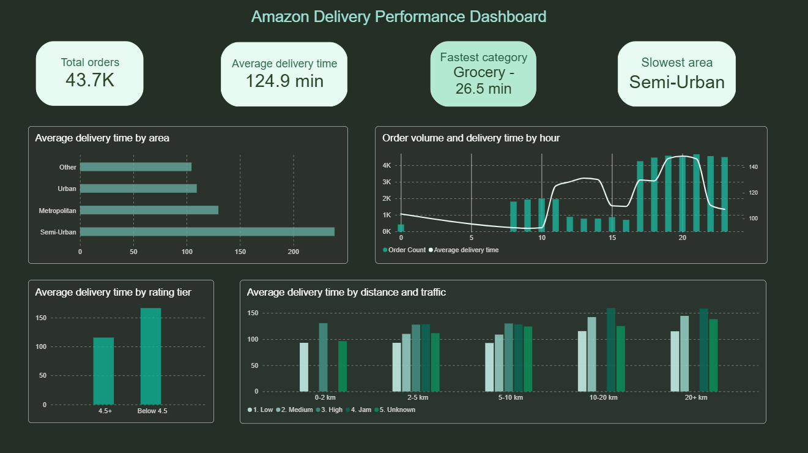

# Amazon Delivery Performance Analysis, SQL & Power BI

This project analyses 43,739 Amazon delivery orders to examine what actually drives delivery time — distance, traffic, weather, delivery area, agent rating, and product category.

## What I did

Built a full SQL pipeline covering database setup, data exploration, quality checks, cleaning, and analysis. Corrected a latitude/longitude sign-flip error, converted placeholder null values, fixed a categorical typo, and standardised date/time fields.

Exploratory analysis examined delivery time against distance, traffic, weather, area, agent rating, category, and time of day, cross-checking apparent patterns against other factors to confirm they were genuine rather than caused by something else.

## What I found

- Traffic level affects delivery time far more than distance does — at the same distance, Jam traffic adds 30-65 minutes compared to Low traffic
- Delivery area affects delivery time on its own, separate from traffic — Semi-Urban orders average around 240 minutes versus 98-135 minutes elsewhere, a gap that holds even within the same traffic level
- Cloudy and Fog weather slow down long-distance deliveries specifically, adding 55-78 minutes past 10km at every traffic level, while other weather types show a much smaller increase
- Higher-rated agents deliver noticeably faster, but as a sharp jump rather than a gradual improvement — agents rated 4.5 and above average 112-121 minutes, agents below 4.5 average 163-182 minutes
- Grocery orders deliver roughly five times faster than every other category, averaging 26.5 minutes against approximately 130 minutes elsewhere
- Order volume and delivery time both rise through the 17:00-23:00 window, peaking at 146-149 minutes between 19:00-21:00, with no orders recorded between 1:00 and 7:00

## What it suggests

Traffic and delivery area are the strongest levers for improving delivery time, with distance itself mattering less past roughly 10km. Weather-related delays are concentrated specifically under Cloudy or Fog conditions at longer distances rather than affecting all deliveries equally, and staffing or routing adjustments during the 17:00-23:00 peak window would likely address the largest single block of slow deliveries.

## Tools

SQL, MySQL, Power BI

## Dashboard Preview

